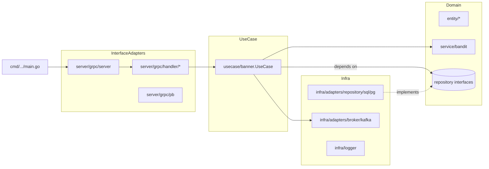

```mermaid
flowchart LR
subgraph Domain
E[entity/*]
S[service/bandit]
R[(repository interfaces)]
end
subgraph UseCase 
U[usecase/banner.UseCase]
end
subgraph Infra
DB[infra/adapters/repository/sql/pg]
MQ[infra/adapters/broker/kafka]
L[infra/logger]
end
subgraph InterfaceAdapters 
H[server/grpc/handler/*]
PB[server/grpc/pb]
SV[server/grpc/server]
end
M[cmd/.../main.go]

M --> SV
SV --> H
H --> U
U -->|depends on| R
U --> S
U --> MQ
DB -.implements .-> R
```