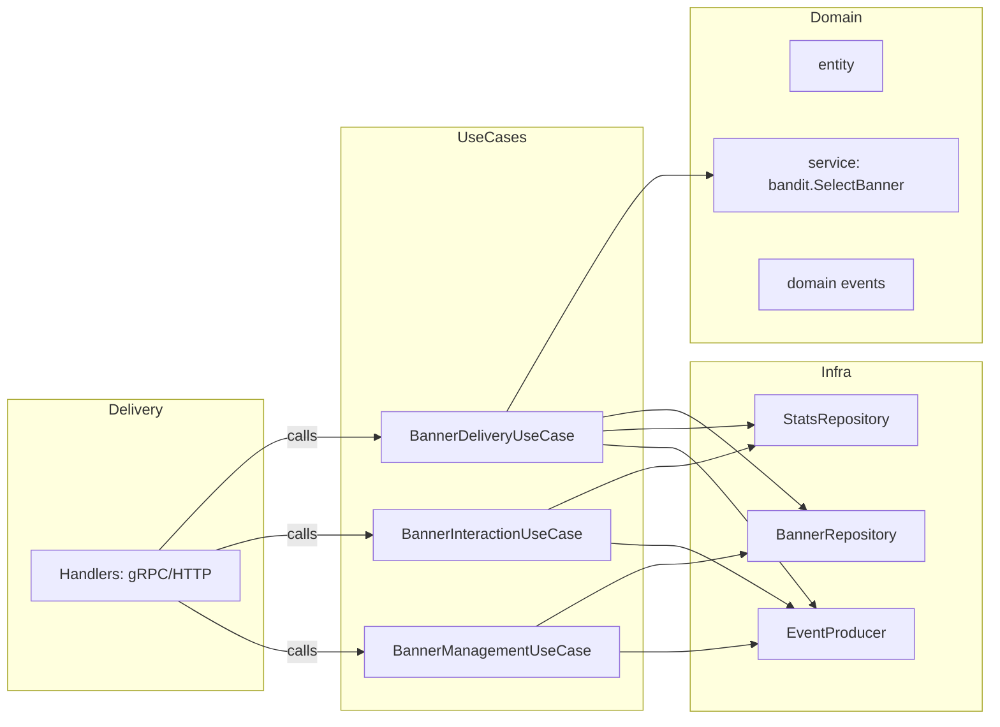

```mermaid
flowchart LR
  subgraph Domain
    A[entity]
    B[service: bandit.SelectBanner]
    D[domain events]
  end

  subgraph UseCases
    U1[BannerDeliveryUseCase]
    U2[BannerInteractionUseCase]
    U3[BannerManagementUseCase]
  end

  subgraph Infra
    R1[BannerRepository]
    R2[StatsRepository]
    BR[EventProducer]
  end

  subgraph Delivery
    H[Handlers: gRPC/HTTP]
  end

  H -->|calls| U1
  H -->|calls| U2
  H -->|calls| U3

  U1 --> B
  U1 --> R1
  U1 --> R2
  U1 --> BR

  U2 --> R2
  U2 --> BR

  U3 --> R1
  U3 --> BR
```
