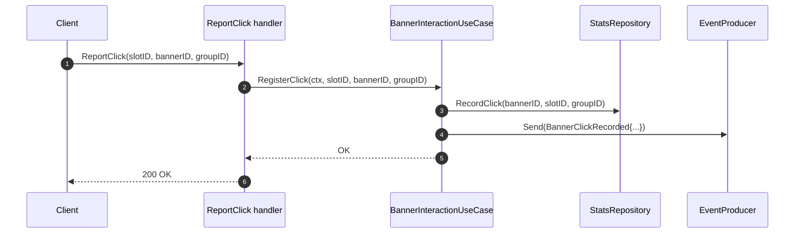

```mermaid
sequenceDiagram
  autonumber
  participant Client
  participant API as ReportClick handler
  participant UC as BannerInteractionUseCase
  participant RepoS as StatsRepository
  participant Broker as EventProducer

  Client->>API: ReportClick(slotID, bannerID, groupID)
  API->>UC: RegisterClick(ctx, slotID, bannerID, groupID)
  UC->>RepoS: RecordClick(bannerID, slotID, groupID)
  UC->>Broker: Send(BannerClickRecorded{...})
  UC-->>API: OK
  API-->>Client: 200 OK
```
