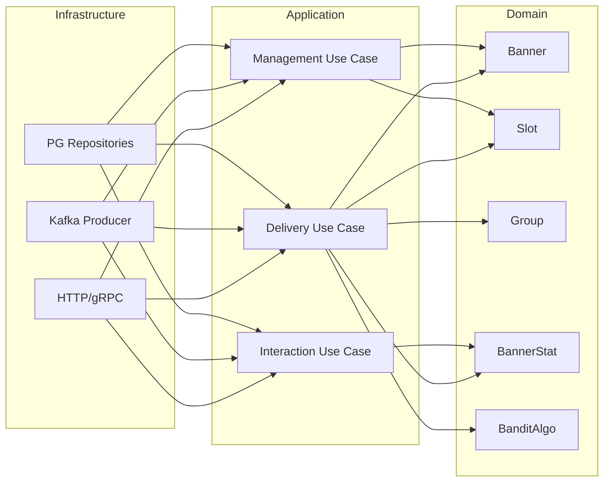

Диаграмма включающая все 3 слоя. Верхнеуровнево описывает бизнес смысл доменных сущностей в контексте 3 use cases.  
Также описывается имеющийся инфраструктурный слой и направление зависимостей внутри приложения.  
Big picture.  

