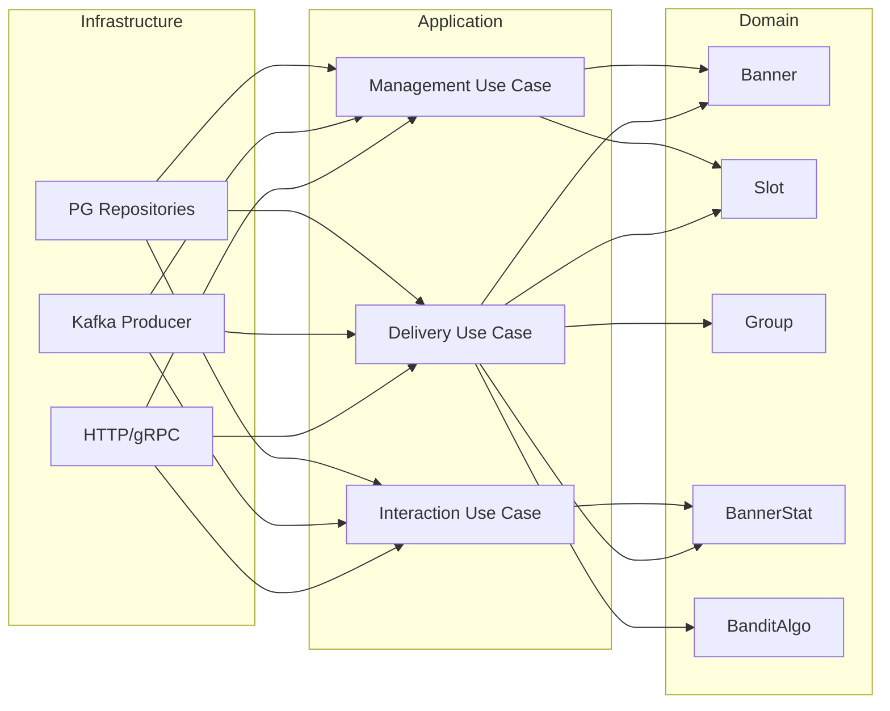

```mermaid
graph LR
subgraph Domain
G[Banner]
H[Slot]
I[Group]
J[BannerStat]
K[BanditAlgo]
end
subgraph Application
  D[Delivery Use Case]
  E[Interaction Use Case]
  F[Management Use Case]
end

subgraph Infrastructure
  A[HTTP/gRPC]
  B[Kafka Producer]
  C[PG Repositories]
end

D --> G
D --> H
D --> I
D --> J
D --> K
E --> J
F --> G
F --> H
A --> D
A --> E
A --> F
B --> D
B --> E
B --> F
C --> D
C --> E
C --> F
```
