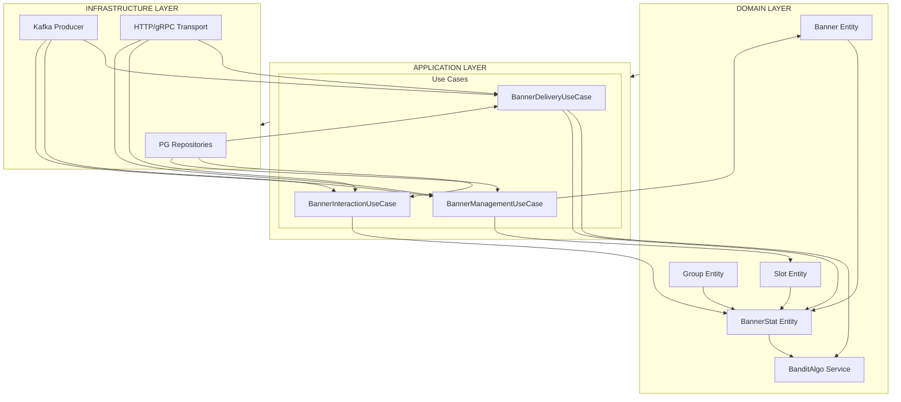

```mermaid
flowchart TD
    subgraph DOMAIN["DOMAIN LAYER"]
        direction TB
        BANNER[Banner Entity]
        SLOT[Slot Entity]
        GROUP[Group Entity]
        BANNERSTAT[BannerStat Entity]
        BANDIT[BanditAlgo Service]
        
        BANNER --> BANNERSTAT
        SLOT --> BANNERSTAT
        GROUP --> BANNERSTAT
        BANNERSTAT --> BANDIT
    end

    subgraph APPLICATION["APPLICATION LAYER"]
        direction TB
        UC_SUB["Use Cases"]
        
        subgraph UC_SUB["Use Cases"]
            direction LR
            DELIVERY[BannerDeliveryUseCase]
            INTERACTION[BannerInteractionUseCase]
            MANAGEMENT[BannerManagementUseCase]
        end
    end

    subgraph INFRASTRUCTURE["INFRASTRUCTURE LAYER"]
        direction TB
        PG[PG Repositories]
        KAFKA[Kafka Producer]
        HTTP[HTTP/gRPC Transport]
    end

    DOMAIN --> APPLICATION
    APPLICATION --> INFRASTRUCTURE
    
    DELIVERY --> BANDIT
    DELIVERY --> BANNERSTAT
    INTERACTION --> BANNERSTAT
    MANAGEMENT --> BANNER
    MANAGEMENT --> SLOT
    
    HTTP --> DELIVERY
    HTTP --> INTERACTION
    HTTP --> MANAGEMENT
    PG --> DELIVERY
    PG --> INTERACTION
    PG --> MANAGEMENT
    KAFKA --> DELIVERY
    KAFKA --> INTERACTION
    KAFKA --> MANAGEMENT
```
