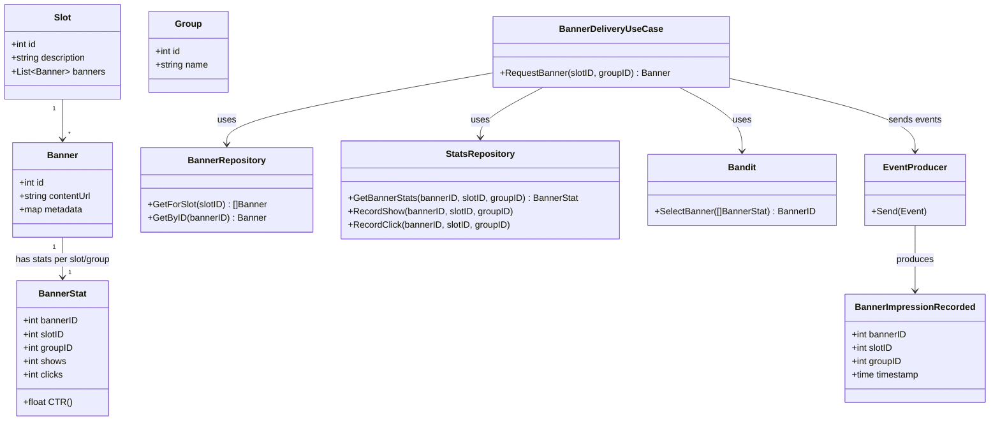

```mermaid
classDiagram
class Banner {
+int id
+string contentUrl
+map metadata
}

    class Slot {
        +int id
        +string description
        +List~Banner~ banners
    }

    class Group {
        +int id
        +string name
    }

    class BannerStat {
        +int bannerID
        +int slotID
        +int groupID
        +int shows
        +int clicks
        +float CTR()
    }

    class BannerRepository {
        +GetForSlot(slotID) []Banner
        +GetByID(bannerID) Banner
    }

    class StatsRepository {
        +GetBannerStats(bannerID, slotID, groupID) BannerStat
        +RecordShow(bannerID, slotID, groupID)
        +RecordClick(bannerID, slotID, groupID)
    }

    class Bandit {
        +SelectBanner([]BannerStat) BannerID
    }

    class EventProducer {
        +Send(Event)
    }

    class BannerImpressionRecorded {
        +int bannerID
        +int slotID
        +int groupID
        +time timestamp
    }

    class BannerDeliveryUseCase {
        +RequestBanner(slotID, groupID) Banner
    }

    %% Relations
    Slot "1" --> "*" Banner
    Banner "1" --> "1" BannerStat : has stats per slot/group
    BannerDeliveryUseCase --> BannerRepository : uses
    BannerDeliveryUseCase --> StatsRepository : uses
    BannerDeliveryUseCase --> Bandit : uses
    BannerDeliveryUseCase --> EventProducer : sends events
    EventProducer --> BannerImpressionRecorded : produces
```