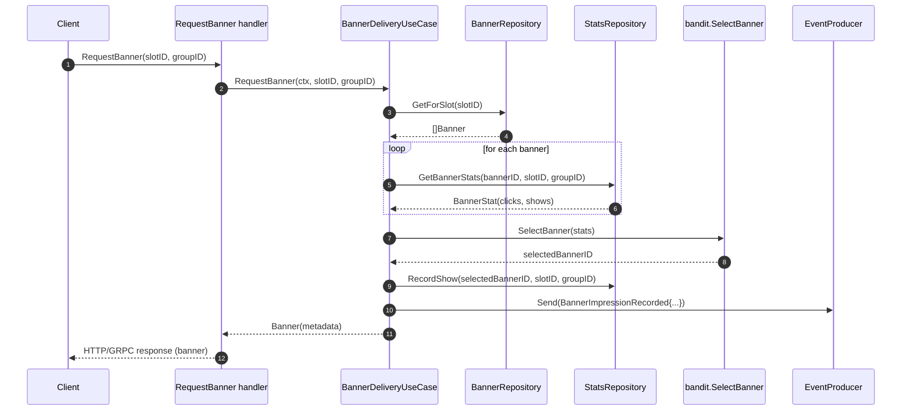

```mermaid
sequenceDiagram
  autonumber
  participant Client
  participant API as RequestBanner handler
  participant UC as BannerDeliveryUseCase
  participant RepoB as BannerRepository
  participant RepoS as StatsRepository
  participant Bandit as bandit.SelectBanner
  participant Broker as EventProducer

  Client->>API: RequestBanner(slotID, groupID)
  API->>UC: RequestBanner(ctx, slotID, groupID)
  UC->>RepoB: GetForSlot(slotID)
  RepoB-->>UC: []Banner
  loop for each banner
    UC->>RepoS: GetBannerStats(bannerID, slotID, groupID)
    RepoS-->>UC: BannerStat(clicks, shows)
  end
  UC->>Bandit: SelectBanner(stats)
  Bandit-->>UC: selectedBannerID
  UC->>RepoS: RecordShow(selectedBannerID, slotID, groupID)
  UC->>Broker: Send(BannerImpressionRecorded{...})
  UC-->>API: Banner(metadata)
  API-->>Client: HTTP/GRPC response (banner)
```
