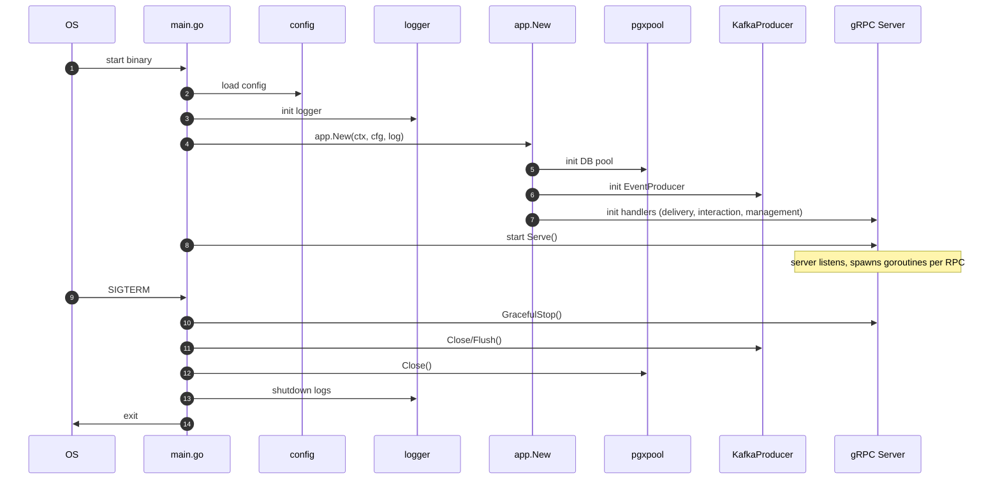

```mermaid
sequenceDiagram
  autonumber
  participant OS
  participant main as main.go
  participant cfg as config
  participant log as logger
  participant app as app.New
  participant db as pgxpool
  participant broker as KafkaProducer
  participant grpc as gRPC Server

  OS->>main: start binary
  main->>cfg: load config
  main->>log: init logger
  main->>app: app.New(ctx, cfg, log)
  app->>db: init DB pool
  app->>broker: init EventProducer
  app->>grpc: init handlers (delivery, interaction, management)
  main->>grpc: start Serve()
  Note over grpc: server listens, spawns goroutines per RPC

  OS->>main: SIGTERM
  main->>grpc: GracefulStop()
  main->>broker: Close/Flush()
  main->>db: Close()
  main->>log: shutdown logs
  main->>OS: exit
```
