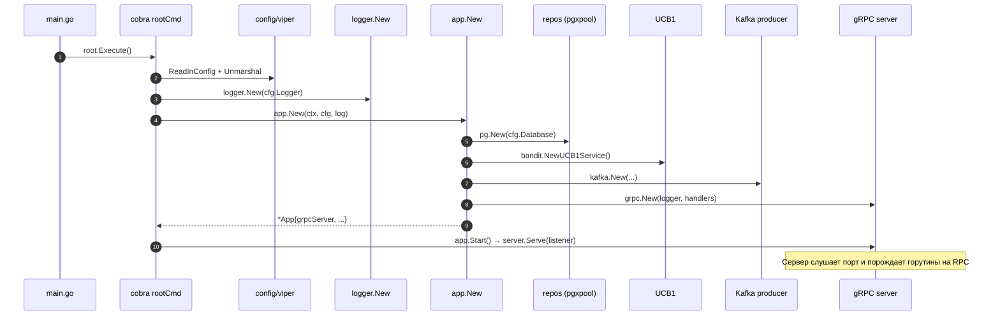

```mermaid
sequenceDiagram
autonumber
participant main as main.go
participant cli as cobra rootCmd
participant cfg as config/viper
participant log as logger.New
participant app as app.New
participant repo as repos (pgxpool)
participant bandit as UCB1
participant broker as Kafka producer
participant grpc as gRPC server

main->>cli: root.Execute()
cli->>cfg: ReadInConfig + Unmarshal
cli->>log: logger.New(cfg.Logger)
cli->>app: app.New(ctx, cfg, log)
app->>repo: pg.New(cfg.Database)
app->>bandit: bandit.NewUCB1Service()
app->>broker: kafka.New(...)
app->>grpc: grpc.New(logger, handlers)
app-->>cli: *App{grpcServer, ...}
cli->>grpc: app.Start() → server.Serve(listener)
Note over grpc: Сервер слушает порт и порождает горутины на RPC
```
